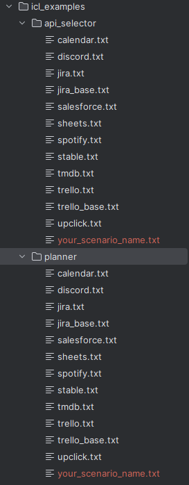

# **Synapse Copilot**

Welcome to the Synapse Copilot, your gateway to effortlessly integrating Large Language Models (LLMs) with a wide array of APIs! Follow this delightful guide to embark on your API scenario adventure. 🎉

# **Quick Start**

Let's dive right in and get you up and running with your very own API scenario!

## **Step 1: Installation**

1. Kickstart your journey by cloning the GitHub repository and installing the required dependencies:

```python
git clone https://github.com/Agile-Loop/Synapse-Copilot.git
cd Synapse-Copilot
pip install –r requiements.txt
```

## **Step 2: Grab your Postman Collection or OpenAPI spec file**

Its great if you have your OpenAPI spec file (version 3.0.0) for your application. You just need to add it in the right directory within the project. Follow the bullet three of step 3.

If you don’t have your OpenAPI spec file already, we can create it using the Postman Collection of your Application scenario. Here are the steps to convert your application’s postman collection into openapi spec file:

1. Export your Postman Collection from Postman Software (desktop/web).
2. Follow the steps listed below to setup your application for Postman to OpenAPI conversion:

### **Steps to setup the application for Postman to OpenAPI conversion**

1. Check if you have node installed in your system. Use the following command to check if you have node installed.

```markdown
node -v
```

It’s great if you have node installed already. But if not, you need to install node in your application first to run this application for the conversion of your postman collection to openapi spec file.

You can install node in your system using the link [here](https://nodejs.org/en/download).

Once node is installed in your system, you can do following steps in your code:

1. Navigate to directory “api_collection” and setup your application for openapi spec file generation.

```markdown
cd api_collection
npm i postman-to-openapi -g
```

This will install the `node_modules` in the api_collection directory. Now, you need to use `p2o` command to generate your openapi spec file from the postman collection. Below is the command skeleton. You need to change the name of your files accordingly.

```markdown
p2o test\resources\input\your_postman_collection.postman_collection.json -f test\resources\output\your_spec_file_name.yml -o test\resources\input\options.json
```

Navigate to output directory

```markdown
cd test/resources/output
```

1. You will see the your output openapi spec file but in .yml format.
2. Go [here](https://onlineyamltools.com/convert-yaml-to-json) and paste your yml file content in yaml input (left side).
3. Select `copy to clipboard` from json output column (right side).
4. Create a new file on local system with your scenario name in .json extension like “your_scenaio_name_oas.json” and paste the content there.
5. Place your ready json file of OpenAPI specifications in `specs` as mentioned in step 3 below.

## **Step 3: Selecting and Adding a Scenario**

It's time to craft your unique API scenario!

1. Select an appropriate scenario name because it is to be added for validation and further usage. use single word `lower case` name for your scenario. You can take “**trello**”, “**stablediffusion**”, “**google_sheets**” as an example.
2. **Add the scenario name:** Open `model/api_llm.py` and add your scenario name to the `ApiLLM` class constructor.

```python
    def __init__(
            self,
            llm: BaseLLM,
            api_spec: ReducedOpenAPISpec,
            scenario: str,
            requests_wrapper: RequestsWrapper,
            caller_doc_with_response: bool = False,
            parser_with_example: bool = False,
            simple_parser: bool = False,
            callback_manager: Optional[BaseCallbackManager] = None,
            **kwargs: Any,
    ) -> None:
        if scenario not in [
            "tmdb", "spotify", "stable", "calendar", "notion", "upclick",
            "discord", "sheets", "trello", "jira", "salesforce", "your_scenario_name"
        ]:
            raise ValueError(f"Invalid scenario {scenario}")
```

1. **Provide the spec file:** Navigate to the `specs` directory and add your scenario's OpenAPI specification file.
2. **Configure your credentials:** In the `config.yaml` file, add your application's secret keys or tokens in this file:

```python
OPENAI_KEY: "YOUR OPENAI API KEY"

TMDB_ACCESS_TOKEN: "YOUR TMDB ACCESS TOKEN"

spotipy_client_id: "YOUR SPOTIFY APPLICATION CLIENT ID"
spotipy_client_secret: "YOUR SPOTIFY APPLCIATION CLIENT SECRET"
spotipy_redirect_uri: "URL TO YOUR APPLICATION"

YOUR_SCENARIO_KEY: "YOUR SCENARIO KEY HERE"
YOUR_SCENARIO_SECRET_IF_ANY: "YOUR SCENARIO SECRET HERE"
```

1. **Set the environment:** In `run.py`, set the environment variables for your defined tokens and call the `process_spec_file` method with the path to your OpenAPI specification file you provided above in specs folder.

```python
    elif scenario == "upclick":
        os.environ["UPCLICK_KEY"] = config["UPCLICK_KEY"]

        api_spec, headers = process_spec_file(
            file_path="specs/upclick_oas.json", token=os.environ["UPCLICK_KEY"]
        )

        headers["Content-Type"] = "application/json"
        query_example = "Get me my spaces of team on upclick"

    elif scenario == "your_scenario_name":
        os.environ["YOUR_SCENARIO_KEY"] = config["YOUR_SCENARIO_KEY"]
        os.environ["YOUR_SCENARIO_SECRET (Optional)"] = config["YOUR_SCENARIO_SECRET (Optional)"]

        api_spec, headers = process_spec_file(
            file_path="specs/your_scenario_name_oas.json", token=os.environ["YOUR_SCENARIO_KEY"]
        )
        query_example = "An example query from your scenario to set as default"

    elif scenario == "jira":
        # jira code here
    elif scenario == "trello":
        # trello code here
    elif scenario == "salesforce":
        # salesforce code here
    else:
        raise ValueError(f"Unsupported scenario: {scenario}")
```

1. Go to `helper.py` file and review the `process_spec_file()` method to modify the condition of your scenario if you need any custom output from your scenario. The basic purpose of this method is to return the processed version of your provided original spec file and any headers which the API request accepts.

```python
def process_spec_file(file_path: str = None, token: str = None, key: str = None, username: str = None):
    with open(file_path) as f:
        raw_api_spec = json.load(f)

    api_spec = reduce_openapi_spec(raw_api_spec, only_required=False)

    if "trello" in file_path:
        params = {
            "key": key,
            "token": token
        }
        return api_spec, params

    if "jira" in file_path:
        credentials = f'{username}:{token}'
        encoded_credentials = b64encode(credentials.encode('utf-8')).decode('utf-8')
        headers = {
            'Authorization': f'Basic {encoded_credentials}'
        }
        return api_spec, headers

    if "salesforce" in file_path:
        headers = {
            'Authorization': f'Bearer {token}'
        }
        return api_spec, headers

    if "your_scenario_name" in file_path:
        headers = {
            'Authorization': f'Bearer {token}'
        }
        return api_spec, headers
```

1. Navigate to the `icl_examples` directory. In the `api_selector` and `planner` directories, add examples of API calls specific to your scenario, following the same format as the existing examples such as `Spotify`, as shown below. You need to be performing some prompt engineering to generate prompt examples for better results from the LLM.

   Here are the examples for “Spotify” scenario:


   1. api_selector:

```markdown
Example 1:
Background: No background
User query: what is the id of album Kind of Blue.
API calling 1: GET /search to search for the album "Kind of Blue"
API response: Kind of Blue's album_id is 1weenld61qoidwYuZ1GESA

Example 2:
Background: No background
User query: get the newest album of Lana Del Rey (id 00FQb4jTyendYWaN8pK0wa).
API calling 1: GET /artists/00FQb4jTyendYWaN8pK0wa/albums to get the newest album of Lana Del Rey (id 00FQb4jTyendYWaN8pK0wa)
API response: The newest album of Lana Del Rey is Did you know that there's a tunnel under Ocean Blvd (id 5HOHne1wzItQlIYmLXLYfZ), ...

Example 3:
Background: The ids and names of the tracks of the album 1JnjcAIKQ9TSJFVFierTB8 are Yellow (3AJwUDP919kvQ9QcozQPxg), Viva La Vida (1mea3bSkSGXuIRvnydlB5b)
User query: append the first song of the newest album 1JnjcAIKQ9TSJFVFierTB8 of Coldplay (id 4gzpq5DPGxSnKTe4SA8HAU) to my player queue.
API calling 1: POST /me/player/queue to add Yellow (3AJwUDP919kvQ9QcozQPxg) to the player queue
API response: Yellow is added to the player queue
```

   2. planner:

```markdown
Example 1:
User query: set the volume to 20 and skip to the next track.
Plan step 1: set the volume to 20
API response: Successfully called PUT /me/player/volume to set the volume to 20.
Plan step 2: skip to the next track
API response: Successfully called POST /me/player/next to skip to the next track.
Thought: I am finished executing a plan and completed the user's instructions
Final Answer: I have set the volume to 20 and skipped to the next track.

Example 2:
User query: Make a new playlist called "Love Coldplay" containing the most popular songs by Coldplay
Plan step 1: search for the most popular songs by Coldplay
API response: Successfully called GET /search to search for the artist Coldplay. The id of Coldplay is 4gzpq5DPGxSnKTe4SA8HAU
Plan step 2: Continue. search for the most popular songs by Coldplay (4gzpq5DPGxSnKTe4SA8HAU)
API response: Successfully called GET /artists/4gzpq5DPGxSnKTe4SA8HAU/top-tracks to get the most popular songs by Coldplay. The most popular songs by Coldplay are Yellow (3AJwUDP919kvQ9QcozQPxg), Viva La Vida (1mea3bSkSGXuIRvnydlB5b).
Plan step 3: make a playlist called "Love Coldplay"
API response: Successfully called GET /me to get the user id. The user id is xxxxxxxxx.
Plan step 4: Continue. make a playlist called "Love Coldplay"
API response: Successfully called POST /users/xxxxxxxxx/playlists to make a playlist called "Love Coldplay". The playlist id is 7LjHVU3t3fcxj5aiPFEW4T.
Plan step 5: Add the most popular songs by Coldplay, Yellow (3AJwUDP919kvQ9QcozQPxg), Viva La Vida (1mea3bSkSGXuIRvnydlB5b), to playlist "Love Coldplay" (7LjHVU3t3fcxj5aiPFEW4T)
API response: Successfully called POST /playlists/7LjHVU3t3fcxj5aiPFEW4T/tracks to add Yellow (3AJwUDP919kvQ9QcozQPxg), Viva La Vida (1mea3bSkSGXuIRvnydlB5b) in playlist "Love Coldplay" (7LjHVU3t3fcxj5aiPFEW4T). The playlist id is 7LjHVU3t3fcxj5aiPFEW4T.
Thought: I am finished executing a plan and have the data the used asked to create
Final Answer: I have made a new playlist called "Love Coldplay" containing Yellow and Viva La Vida by Coldplay.
```

Tailor these examples to match your scenario's unique use case.

Your icl_examples directory should look like the example image provided below:


## **Step 4: Run the Project**

Once all of the changes are in place, you are good to run the application. You should be in the `Synapse-Copilot` directory. You can run your project like this:
```python
cd Synapse-Copilot
python run.py
```

## **Step 5: Import Database File**
Once all steps are done you have to upload your database file ```synapse-copilot.sql``` file in mysql or any alternative but we are providing support for mysql currently.


Done! You are good to go.

# Guide for the Possible Changes might need in specs file

There are few changes/adjustments which you might need to perform in the specs file you’ve created.

1. **Postman Environment Variables**: Check if there were any variables being used in the postman collection. You need to replace them with the actual values.
2. **Paths**: The OpenAPI spec file is basically an object with key-value pairs. So there is a pair with the key “paths”. Navigate to it and see the path routes in it. Just to make sense here, it must be the route after the base url of the application.

   For example the complete URL is:

   ```markdown
   https://api.trello.com/1/boards/
   ```

   And your application’s base url is: [https://api.trello.com](https://api.trello.com/), all the paths must start with the route after the base url like this: `/1/boards/` .

# 🚨 Disclaimer

While the scenarios available in the application strive for universality, some may require slight adjustments based on their API interactions. Ensure that your specification file is correctly formatted for the agent's consumption. You can refer to other applications' specification files as formatting examples. Additionally, specification files often require minor modifications, such as removing the base URL from the API documentation paths.

# 🌟 Contributing

We welcome contributions to Synapse Copilot with open arms! If you have any brilliant ideas, bug reports, or feature requests, please open an issue or submit a pull request. Together, we can make this project even more remarkable! 🎉

## 💡 Why Us?
Choosing the right tools and frameworks is crucial for the success of your project. Here's why Synapse Copilot stands out as the premier choice for developers and organizations leveraging SAAS architectures:

🌐 **Universal Compatibility**
- Seamless Integration: Synapse Copilot is designed to be universally compatible with every SAAS architecture. Whether you're working on a small-scale project or a large enterprise system, our solution integrates smoothly, ensuring a hassle-free setup and operation.

🎯 **Unmatched Accuracy**
- Precision at Its Best: We understand the importance of accuracy in your operations. Synapse Copilot boasts a 100% accuracy rate, setting a new standard in the industry. Our commitment to precision ensures that your projects are executed flawlessly, every time.

🛠️ **Enhanced Control**
- Empower Your Creativity: With Synapse Copilot, you gain more control over your projects through advanced Prompt Engineering. This feature allows you to tailor the functionality to your specific needs, offering unparalleled flexibility and efficiency. Unleash your creativity and push the boundaries of what's possible with our intuitive control mechanisms.

# 📝 License

This project is licensed under the [MIT License](LICENSE).

Let's get coding! 💻
